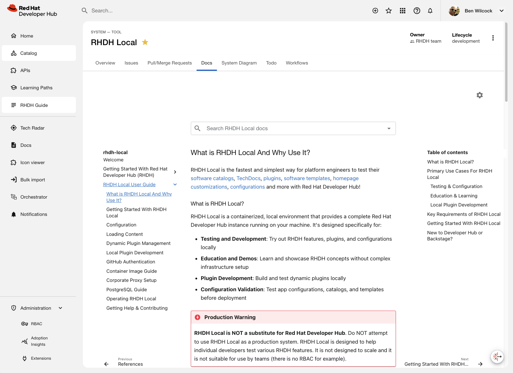

# rhdh-lab

A customizable development and testing environment for [Red Hat Developer Hub](https://developers.redhat.com/rhdh) (RHDH). Wraps the official [rhdh-local](https://github.com/redhat-developer/rhdh-local) project with a copy-sync customization system, lifecycle scripts, and plugin management.



> **Note:** This is for development and testing only, not for production use.

## Prerequisites

- [Podman](https://podman.io/docs/installation) v5.4.1+ (recommended) or [Docker](https://docs.docker.com/engine/) v28.1.0+ with Compose support
- [Git](https://git-scm.com/)
- ~10 GB disk space for container images

## Quick Start

### 1. Clone the repository

```bash
git clone --recurse-submodules https://github.com/benwilcock/rhdh-lab.git rhdh-lab
cd rhdh-lab
```

### 2. Configure your environment

```bash
cp rhdh-customizations/.env.example rhdh-customizations/.env
```

Edit `rhdh-customizations/.env` and fill in your credentials (GitHub OAuth, email, etc.). See the comments in `.env.example` for guidance on each variable. For a full walkthrough, see the [Customization Guide](docs/customization-guide.md).

### 3. Start RHDH

```bash
./up.sh --customized
```

### 4. Open RHDH

Browse to <http://localhost:7007> and log in.

### 5. Stop RHDH

```bash
./down.sh
```

## Project Structure

```
rhdh-lab/
├── up.sh                        # Start RHDH with various configurations
├── down.sh                      # Stop RHDH (always restores pristine state)
├── backup.sh                    # Create portable backup archive
├── rhdh-customizations/         # Your configuration files (edit here)
├── rhdh-local/                  # Upstream RHDH Local project (git submodule)
└── docs/                        # Documentation
```

**Key principle:** All configuration edits go in `rhdh-customizations/`. The `rhdh-local/` directory is a pristine git submodule of the upstream project and should never be modified directly.

## What's Included

- **[Lifecycle scripts](docs/scripts.md)** (`up.sh`, `down.sh`) -- start and stop RHDH with interactive or non-interactive modes, supporting baseline, Lightspeed, and Orchestrator configurations
- **[Copy-sync customization system](docs/architecture.md)** -- keeps your configuration separate from the upstream project for conflict-free updates
- **[Plugin management](docs/baseline-configuration.md)** -- pre-configured dynamic plugins for GitHub, Jenkins, RBAC, TechDocs, notifications, scorecards, and more
- **[Backup and restore](docs/backup.md)** (`backup.sh`) -- portable archives of your setup
- **[AI coding assistant rules and skills](docs/cursor-rules-and-skills.md)** -- structured guidance in `.cursor/rules/` and `.cursor/skills/` that teaches AI assistants the project's architecture, workflows, and constraints. Works with any assistant using the `*.mdc` format including Claude Code if you ask Claude to add a sutable `CLAUDE.md` file.

## Common Commands

The bash scripts let you launch RHDH Local in various configuration states depending on your needs.

```bash
./up.sh --customized                 # Start with your config
./up.sh --baseline                   # Start pristine RHDH (no customizations)
./up.sh --customized --lightspeed    # Start with Developer Lightspeed AI
./down.sh --keep-volumes             # Stop, keep data for fast restart
./down.sh --volumes                  # Stop, clean slate
./backup.sh                          # Backup customizations
```

Run `./up.sh --help` or `./down.sh --help` for all options.

## Documentation

See the [docs/](docs/README.md) folder for detailed guides:

- [Architecture](docs/architecture.md) -- copy-sync system, directory layout, design principles
- [Scripts Reference](docs/scripts.md) -- `up.sh`, `down.sh`, `backup.sh` in detail
- [Quick Reference](docs/quick-reference.md) -- command cheat sheet
- [Customization Guide](docs/customization-guide.md) -- how to configure RHDH
- [Backup and Restore](docs/backup.md) -- creating and restoring backups
- [Testing Guide](docs/testing.md) -- workflows for customized and pristine modes
- [Baseline Configuration](docs/baseline-configuration.md) -- all enabled plugins and settings
- [Jenkins Integration](docs/jenkins-integration.md) -- Jenkins CI/CD setup
- [Cursor Rules and Skills](docs/cursor-rules-and-skills.md) -- AI assistant guidance for this project

## Updating RHDH Local

One of the main reasons I created this project was because it made it easier to stay up to date with changes in RHDH Local.

```bash
./down.sh
cd rhdh-local && git pull && cd ..
./up.sh --baseline # Handy for checking everything starts up OK before customizing further
```

## License

- **RHDH Local**: Apache 2.0 (see `rhdh-local/LICENSE`)
- **This workspace**: Apache 2.0
